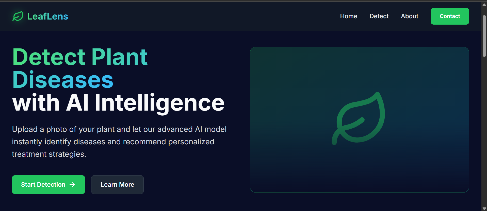
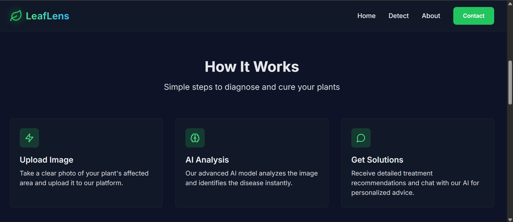
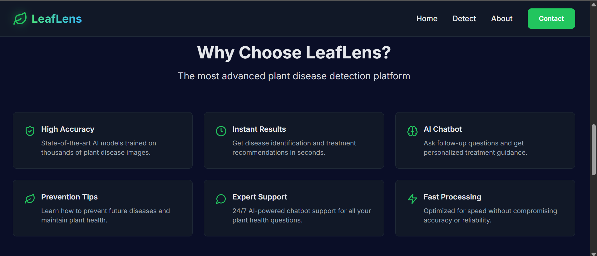
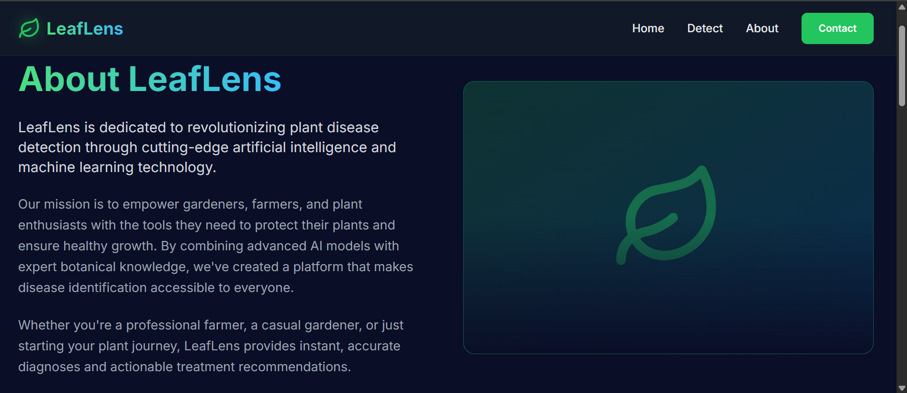
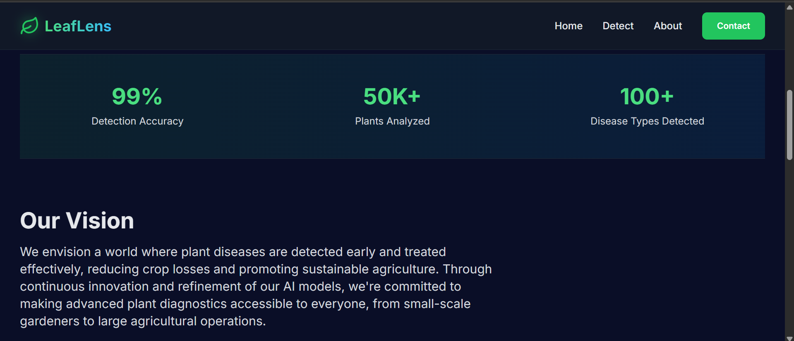
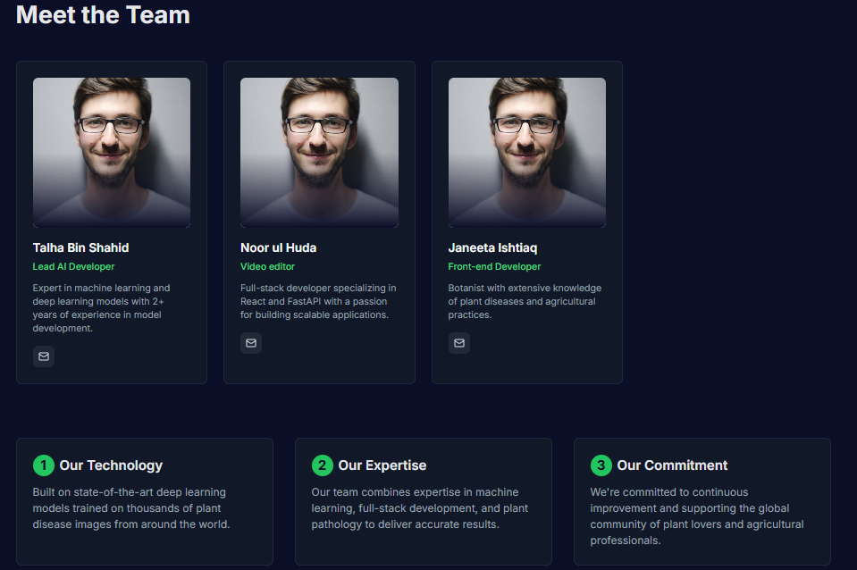
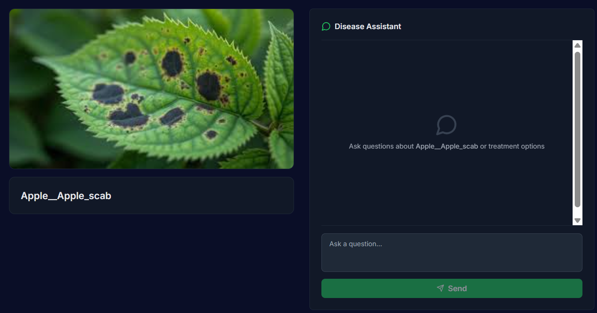
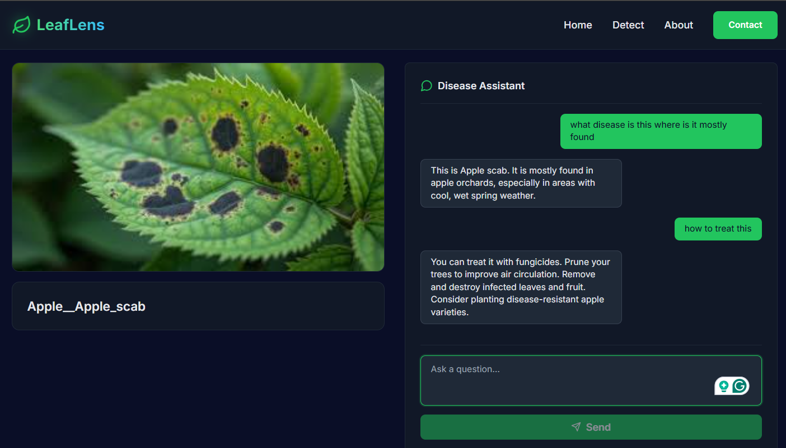

# 🌿 **LeafLens**

LeafLens is a **full-stack app** that helps farmers identify **plant diseases** from images 🌱 and provides **short, actionable guidance** through a chat assistant powered by **Google Generative AI (Gemini)** 🤖.

> “This README provides a structured overview of the project, setup instructions, and screenshots for a quick visual understanding.”

---

## 🧰 **Tech Stack Overview**

| Layer              | Technology                        |
| ------------------ | --------------------------------- |
| **Backend**        | FastAPI, TensorFlow/Keras, Python |
| **Frontend**       | React, TypeScript, Vite           |
| **AI Integration** | Google Generative AI (Gemini)     |

---

## ⚡ **Key Features**

<div style="border:1px solid #ddd; padding: 10px; margin-bottom: 10px; border-radius: 8px;">
<ul>
<li>✨ Upload an image and receive a predicted disease label</li>
<li>💬 Start a chat session for disease-specific guidance (powered by Gemini)</li>
<li>🧩 Minimal frontend (Vite + React/TypeScript) showcasing image upload, prediction, and chat</li>
</ul>
</div>

---

## 📂 **Repository Structure**

```
LeafLens/
├── backend/
│   ├── app.py                # FastAPI app (endpoints, model, chat session)
│   ├── inception_plantvillage.h5   # Pretrained Keras model
│   ├── models.py             # Pydantic request models
│   └── requirements.txt      # Backend dependencies
│
├── Frontend/
│   ├── src/lib/api.ts        # Helper for API requests
│   ├── src/pages/Detect.tsx  # Image upload & prediction
│   ├── src/pages/Results.tsx # Results & chat UI
│   └── package.json          # Frontend dependencies
```

---

## 🧩 **Backend API Overview**

### 🔹 Endpoints

| Endpoint      | Method | Description                                                                          |
| ------------- | ------ | ------------------------------------------------------------------------------------ |
| `/predict`    | POST   | Accepts an image and returns predicted disease label `{ predicted_disease: string }` |
| `/start_chat` | POST   | Starts a chat session; returns `{ session_id, message }`                             |
| `/chat`       | POST   | Sends a user message and receives Gemini response `{ response }`                     |
| `/end_chat`   | POST   | Ends a chat session `{ message: "Chat session ended." }`                             |

**Notes:**

* `inception_plantvillage.h5` must exist in `backend/`
* Set environment variable `GEMINI_API_KEY`
* CORS configured for `http://localhost:5173`, `http://localhost:3000`, and optional `FRONTEND_URL`

---

## 💻 **Frontend API Helpers**

| Function                                  | Description                    |
| ----------------------------------------- | ------------------------------ |
| `predictPlantDisease(imageFile)`          | Uploads image → `/predict`     |
| `startChatSession(disease)`               | Starts session → `/start_chat` |
| `sendChatMessage(sessionId, userMessage)` | Sends message → `/chat`        |
| `endChatSession(sessionId)`               | Ends session → `/end_chat`     |

**Default API base URL:** `http://127.0.0.1:5000`

> Can be overridden via `.env.local` → `import.meta.env.SERVER_URL`

---

## 🚀 **Setup & Run (Development)**

### 1️⃣ Backend Setup (Windows PowerShell)

```powershell
# Create and activate virtual environment
python -m venv .venv
.\.venv\Scripts\Activate.ps1

# Install dependencies
pip install -r backend/requirements.txt

# Check the model file
dir backend\inception_plantvillage.h5

# Set Gemini API Key
setx GEMINI_API_KEY "<YOUR_GEMINI_API_KEY>"

# Run backend on port 5000
cd backend
uvicorn app:app --reload --port 5000
```

### 2️⃣ Frontend Setup

```powershell
cd Frontend
npm install
npm run dev
# Default: http://localhost:5173
```

### 3️⃣ End-to-End

1. Open `http://localhost:5173` in browser
2. Upload an image on the **Detect** page
3. View predictions and start a chat for guidance

---

## 🖼️ **Screenshots / Demo**

### 🏠 Landing / Home Page

| Screenshot 1                   | Screenshot 2                   | Screenshot 3                   |
| ------------------------------ | ------------------------------ | ------------------------------ |
|  |  |  |

### 📖 About Page

| Screenshot 1               | Screenshot 2               | Screenshot 3               |
| -------------------------- | -------------------------- | -------------------------- |
|  |  |  |

### 🖼️ Detection Page

| Screenshot 1                 | Screenshot 2                 | Screenshot 3                 |
| ---------------------------- | ---------------------------- | ---------------------------- |
|  |  |  |


---

## 🔧 **Environment Variables**

| Component | Variable                     | Description                           |
| --------- | ---------------------------- | ------------------------------------- |
| Backend   | `GEMINI_API_KEY`             | Required for Gemini chat              |
| Backend   | `FRONTEND_URL`               | Optional allowed CORS origin          |
| Frontend  | `import.meta.env.SERVER_URL` | Backend URL if different from default |

---

## ⚠️ Troubleshooting

* **Model load errors** – Ensure `inception_plantvillage.h5` exists and TensorFlow version matches
* **API key errors** – Set `GEMINI_API_KEY` in environment or `.env`
* **CORS / Connection issues** – Match frontend origin with backend CORS, confirm ports

---

## 🔒 Security & Production Notes

* Sessions are **in-memory**, not persisted
* Do **not** commit API keys or secrets
* For production: add rate-limiting, logging, and error handling

---

## 🚧 Next Steps / Improvements

✅ Store chat history in a database
✅ Add unit & integration tests
✅ Add health/readiness endpoints
✅ Improve error messages & unify ports

---

## 🤝 Contributing

Pull requests and issues welcome! Include relevant tests and keep PRs focused.

---

## 📜 License

No license file yet.

---


